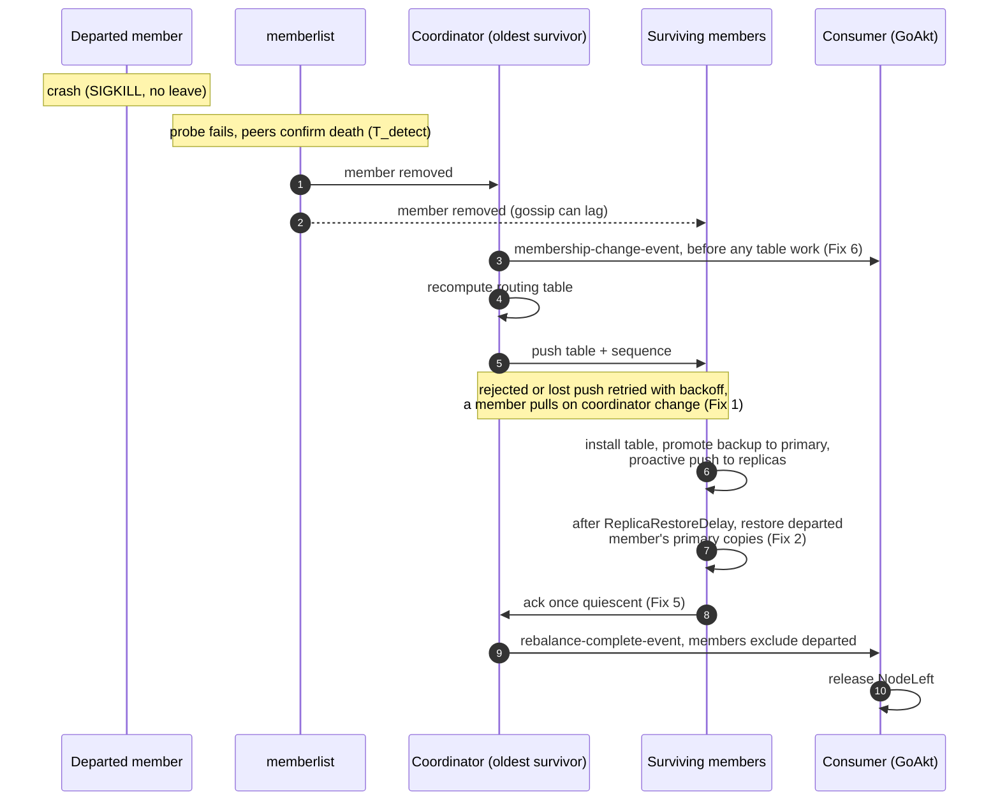

# Node-left convergence after an abrupt departure

Scope: every gap found during the investigation, so that this issue does not have to be reopened. See
[Implementation notes](#implementation-notes) for what the code does against the fixes as described.

Tracks the olric side of [GoAkt issue #1340](https://github.com/Tochemey/goakt/issues/1340): after a
`SIGKILL`, GoAkt's `NodeLeft` event is held until its 30-second fallback because the olric routing
table does not converge on the departure in time.

Investigated on this fork at `v0.3.19` against GoAkt `v4.5.3+6` (`8809865138e6`). The fork branched from upstream `olric-data/olric` at upstream's `v0.5.7` and has versioned its releases independently since, so `v0.3.19` is the fork's own number and does not correspond to any upstream release. The [root-cause table](#root-causes-and-provenance) checks each cause in that base (`v0.5.7`) and in upstream's latest (`v0.7.4`) to show whether the bug was inherited from upstream and whether upstream has since fixed it.

## Table of Contents

* [Background](#background)
* [Evidence](#evidence)
* [Root causes and provenance](#root-causes-and-provenance)
* [Gap register](#gap-register)
* [Industry practice](#industry-practice)
* [Design rules for the fix](#design-rules-for-the-fix)
* [Principles and performance check](#principles-and-performance-check)
* [Convergence flow after a departure](#convergence-flow-after-a-departure)
* [Fixes](#fixes)
* [Implementation notes](#implementation-notes)
* [Validation plan](#validation-plan)
* [Throughput, latency and GC impact](#throughput-latency-and-gc-impact)
* [What users should expect](#what-users-should-expect)
* [Scale behaviour after the fixes](#scale-behaviour-after-the-fixes)
* [Graceful shutdown and rolling restarts](#graceful-shutdown-and-rolling-restarts)
* [Membership announcement model](#membership-announcement-model)
* [Decisions that are not gaps](#decisions-that-are-not-gaps)
* [Recommendations for GoAkt](#recommendations-for-goakt)
* [Decisions taken](#decisions-taken)
* [Reproduction recipe](#reproduction-recipe)

## Background

GoAkt defers `NodeLeft` until the coordinator publishes a `rebalance-complete-event` whose `members`
list no longer contains the departed node (`internal/cluster/cluster.go` in GoAkt,
`processRebalanceComplete`). A departure that no completion reflects within `pendingEventEmitTimeout`
(30s, not configurable) is emitted anyway with the warning the reporter quoted.

Two GoAkt facts shape the failure:

* GoAkt hosts cluster singletons on the **oldest** node, and olric's coordinator is also the oldest
  node. The reporter's scenario, "kill the node hosting the singleton", therefore always kills the
  **coordinator**.
* GoAkt's olric configuration (`buildConfig`): `ReplicaCount 2`, `WriteQuorum 1`, `ReadQuorum 1`,
  sync replication, `TriggerBalancerInterval 1s`, `RoutingTablePushInterval` = `ClusterStateSyncInterval`
  (default **1 minute**), `InitialSyncEmptyPartitionTimeout` = `BootstrapTimeout / 2` (default **5s**),
  `EnableProactiveSyncOnJoin true`, memberlist LAN preset (probe 1s, suspicion multiplier 4). With TLS
  enabled GoAkt switches memberlist to a 5s probe interval, a 2s probe timeout and no TCP fallback pings.

## Evidence

A scratch test (since removed, recipe [below](#reproduction-recipe)) ran a **4-node** loopback cluster
with the GoAkt-equivalent configuration, 3000 keys, and crashed one node without a memberlist leave.
Times are relative to the crash and measured on a surviving member's `cluster.events` subscription.
Larger sizes were not measured; the [scale table](#expected-nodeleft-latency-by-cluster-size) below
derives them from memberlist's formulas and flags them as projections.

| Scenario                                                                                 | memberlist drops the node | first `rebalance-complete` without it |
|------------------------------------------------------------------------------------------|---------------------------|---------------------------------------|
| coordinator crash, normal gossip (3 runs)                                                | 5.5–6.5s                  | 11.7–12.5s                            |
| non-coordinator crash                                                                    | 5.4s                      | 11.5s                                 |
| coordinator crash, escape lowered to 1s                                                  | 8.4s                      | 10.5s                                 |
| coordinator crash, push rejected (2 of 4 runs with slowed gossip on the new coordinator) | 5.3–6.3s                  | **56.6s**                             |

Log lines from the rejected-push runs, as the reporter would see them at GoAkt's INFO level:

```text
[ERROR] Failed to apply pushed routing table from 127.0.0.1:51104: unrecognized cluster coordinator: 127.0.0.1:51095: 127.0.0.1:51092 => operations.go:147
[WARN] Routing table could not be pushed to 2 member(s): [127.0.0.1:51100 127.0.0.1:51112]. They will receive it on the next update => update.go:337
[ERROR] Failed to move DMap fragment: repro on PartID: 264 to 127.0.0.1:52496: ERR invalid argument: partID: 264 (kind: Backup) doesn't belong to 127.0.0.1:52496
```

The last line repeated once per balancer tick for 45 seconds, until the periodic push at +51s finally
installed the table on the stale member and the epoch completed at +56.6s.

## Root causes and provenance

| Root cause                                                       | Upstream v0.5.7 (fork base)                  | Upstream v0.7.4 (latest) | This fork                                  |
|------------------------------------------------------------------|----------------------------------------------|--------------------------|--------------------------------------------|
| 1. Rejected or lost push not retried until the periodic push     | Present; whole update fails on one rejection | Present, unchanged       | Present; commits to reachable members only |
| 2. Node-left waits for the empty-partition escape                | Absent, no sync state exists                 | Absent                   | Present                                    |
| 3. Write holds the fragment lock across replication, no deadline | Present                                      | Present, unchanged       | Present, untouched                         |

### 1. A rejected or lost table push is not retried until the next periodic push

Path: `listenClusterEvents` → `updateRoutingWithReason` → `updateRoutingTableOnCluster`
(`internal/cluster/routingtable/routingtable.go`, `update.go`).

When the coordinator dies, the oldest survivor computes and pushes the new table roughly 100ms after
its **own** memberlist declares the old coordinator dead. Memberlist propagates that death by gossip,
so for a few hundred milliseconds other members still list the dead node as alive or suspect, and their
`GetCoordinator()` still returns it. Their `verifyRoutingTable` (`operations.go`) rejects the push with
`unrecognized cluster coordinator`.

`updateRoutingTableOnCluster` treats the rejection like an unreachable member: it logs
"They will receive it on the next update" and excludes the member from the epoch. Nothing re-pushes
before `pushPeriodically` fires, one minute later under GoAkt. Meanwhile:

* the stale member keeps a table naming the dead node as owner, and its balancer keeps dialing it;
* members that did install the new table try to move fragments to the stale member for partitions it
  now owns, its `checkOwnership` (`internal/dmap/balance.go`) rejects them, so `movePartition` reports
  `moved = true` and those members never ack;
* the epoch cannot complete, no `rebalance-complete-event` is published, and GoAkt waits out its fallback.

The race requires the new coordinator to be the first survivor to declare the death, which is uniform
among survivors, and its push to land before its dead-node gossip reaches the others. The gossip spread
grows with cluster size (see the scale table), so at 60 members and above a coordinator crash rejects on
some members most of the time. Upstream has the same race; it has no epoch, so the symptom there is a
member routing to the dead node for up to a minute.

### 2. Every node-left convergence waits out the empty-partition escape

Path: `applyRoutingTablePayload` → `partitionsAwaitingData` → `syncState.Reconcile`
(`internal/cluster/routingtable/update.go`, `operations.go`).

After a departure, a survivor that becomes primary owner of a partition it holds no data for asks the
other owners for their key counts. When the dead node's backup copy lives on a **different** survivor,
that survivor answers with a non-zero replica count, so the partition is awaited. But no balancer path
ever moves a backup copy to a new primary owner: `promoteBackupCopies` is local, `primaryCopies` moves
primary fragments from previous primary owners, and `pushPrimaryToBackups` / `backupCopies` target
backup fragments. The awaited fragment never arrives, and the member acks only after
`InitialSyncEmptyPartitionTimeout` elapses. Under GoAkt that is 5s on every departure, on top of memberlist
detection. Lowering the escape to 1s moved convergence from ~6s to ~2s after detection.

The awaiting rule is right to expect that data: the real defect is that nothing delivers it. Until a
write lands on the partition, its only copy stays in one survivor's backup fragment, so a second failure
loses it. The fix is therefore to deliver, not to stop waiting (see Fix 2).

### 3. Writes hold the fragment lock across replication with no deadline

Path: `putOnCluster` → `syncPutOnCluster` (`internal/dmap/put.go`); the same shape in
`deleteKey` → `deleteOnCluster` (`delete.go`).

`putOnCluster` takes the fragment write lock and only then replicates to the backup owners, using the
service context, which has no deadline. When a backup owner is dead and the network drops packets
rather than refusing connections, as Kubernetes and Docker do once a pod or container is gone, each
write blocks for `DialTimeout × (MaxRetries + 1)`, about 20 seconds, while holding the lock.
`Partition.Length()` needs a read lock on every fragment, and it backs `lengthOfPartCommandHandler`,
`prepareLeftOverDataReport`, `partitionsPendingReceive` and the balancer's per-partition checks. So the
coordinator's owner probes in `fillRoutingTable`, the members' key-count probes while installing the
table, and the balancer cycles all stall behind stuck writes to the dead backup. This does not show on
loopback, where a refused connection fails instantly, but it explains why the reporter's environment is
slower than the measurements above. Inherited from upstream unchanged, still present in v0.7.4.

## Gap register

Everything found during the investigation, with the fix that closes it. Nothing in this table is left
open by the plan.

| #   | Gap                                                                                                                                                              | Found in                                | Closed by                                                                  |
|-----|------------------------------------------------------------------------------------------------------------------------------------------------------------------|-----------------------------------------|----------------------------------------------------------------------------|
| G1  | A rejected or lost table push is not retried before the periodic push                                                                                            | root cause 1                            | Fix 1                                                                      |
| G2  | A pull during a fan-out can return the previous table; no anti-entropy pull on coordinator change                                                                | Fix 1 analysis                          | Fix 1                                                                      |
| G3  | No visibility of an epoch that is overdue, nor of which members have not acked                                                                                   | scale review                            | Fix 1                                                                      |
| G4  | The primary copy of a partition is not re-established after its primary owner dies; replication factor stays reduced until a write                               | root cause 2                            | Fix 2                                                                      |
| G5  | Node-left convergence waits the full escape for data that nothing delivers                                                                                       | root cause 2                            | Fix 2                                                                      |
| G6  | A failed proactive primary-to-backup push is never retried for that table                                                                                        | code review                             | Fix 2                                                                      |
| G7  | Writes and deletes hold the fragment lock across replication with no deadline                                                                                    | root cause 3                            | Fix 3, Fix 4                                                               |
| G8  | Replication, lookups and fragment moves dial members memberlist has already removed                                                                              | root cause 3                            | Fix 3                                                                      |
| G9  | The balancer parks for a tick after a cycle that moved data before it acks                                                                                       | code review                             | Fix 5                                                                      |
| G10 | A membership change that leaves the table unchanged emits no authoritative event                                                                                 | announcement model                      | Fix 6                                                                      |
| G11 | Every member's local observation is relayed to every member: `members²` deliveries per change                                                                    | announcement model                      | Fix 6                                                                      |
| G12 | Table computation issues one key-count round trip per owner per partition, sequentially, under the routing lock                                                  | scale review                            | Fix 7                                                                      |
| G13 | Membership is re-read from memberlist once per owner per partition during computation                                                                            | scale review                            | Fix 7                                                                      |
| G14 | Push fan-out concurrency equals the coordinator's `NumCPU`                                                                                                       | scale review                            | Fix 7                                                                      |
| G15 | Expected latencies, their formulas and tuning are undocumented                                                                                                   | issue                                   | Fix 8                                                                      |
| G16 | Graceful departures and rolling restarts must not pay for crash recovery: no added shutdown latency, no added data movement when the member returns              | review                                  | Fix 1, Fix 2, [Graceful shutdown](#graceful-shutdown-and-rolling-restarts) |
| G17 | A member that missed an intermediate table does not ack an epoch whose table content recurred: it sees no new generation                                         | found by the rolling-restart scenario   | Fix 1 (table sequence in the push)                                         |
| G18 | A fragment delivered while a member installs a table, between its scan of empty partitions and its reconcile, is waited for again until the escape               | found by the rolling-restart scenario   | Fix 2 (sync state keeps install-time marks)                                |
| G19 | The proactive push ran from the install callback only, once per table, and marked the table done before a partition's data had arrived or when a push had failed | found by the coordinator-crash scenario | Fix 2 (per partition, every cycle, retried)                                |

Two items raised along the way are design choices rather than defects and are recorded in
[Decisions that are not gaps](#decisions-that-are-not-gaps).

## Industry practice

How comparable systems handle a crashed member, with their shipped defaults. The point is not the
absolute numbers but the shape every one of them shares.

| System                     | Failure detection                                        | Default time to confirmed removal                                                           | State dissemination after removal                                                                             |
|----------------------------|----------------------------------------------------------|---------------------------------------------------------------------------------------------|---------------------------------------------------------------------------------------------------------------|
| Consul / Serf (memberlist) | SWIM probes, suspicion with peer confirmations           | ~6s on LAN for small clusters, growing with log10(members)                                  | Gossip with periodic full state sync (push/pull) as anti-entropy                                              |
| Akka Cluster               | Phi accrual heartbeats, 1s interval, 3s acceptable pause | Unreachable in a few seconds; Down only after `stable-after` (20s) via split brain resolver | Gossip, versioned with vector clocks; singleton hand-over only after Down                                     |
| Cassandra                  | Phi accrual, gossip every 1s, convict threshold 8        | Seconds                                                                                     | Versioned gossip state, anti-entropy repair; re-replication restores the replication factor                   |
| Hazelcast                  | Heartbeat deadline detector, 5s heartbeats               | 60s (`max.no.heartbeat.seconds`), phi accrual optional                                      | Master pushes a versioned partition table; members re-fetch on master change; backups promoted and re-created |
| Redis Cluster              | PFAIL by one node, FAIL by majority                      | `cluster-node-timeout` 15s, failover shortly after                                          | Epoch-versioned config broadcast; higher epoch always wins; replica promoted, new replicas migrated           |
| etcd / Raft                | Leader heartbeats                                        | Election timeout 1s, new leader in 1–2s                                                     | Log replication with term fencing                                                                             |
| Kubernetes                 | Kubelet heartbeats                                       | Node NotReady after 40s, pod eviction after 5m                                              | Taint based                                                                                                   |

Common shape:

1. **Two tiers of failure signal.** A fast "suspect / unreachable" signal for fencing and for steering
   traffic away, and a slower "confirmed removed" signal that triggers ownership changes. Nobody moves
   ownership on the fast signal alone.
2. **Detection latency is a configured trade-off, published as a formula.** Faster detection means more
   false positives under GC pauses, CPU throttling and packet loss, which cause flapping and needless data
   movement. Every system documents its formula and recommended ranges per environment and size.
3. **Versioned, fenced state.** Ownership tables carry a monotonic version or epoch. Receivers accept
   newer versions and reject older ones.
4. **Reliable dissemination: push, retry with backoff, plus anti-entropy.** A push is best effort. Failed
   pushes are retried with bounded exponential backoff and jitter, and a periodic reconciliation (pull or
   full-state exchange) guarantees eventual delivery even when every push is lost.
5. **The replication factor is restored after a failure**, not at the next write.
6. **Deadlines on every remote call.** No cluster-internal RPC runs without a timeout, retries to a peer
   already declared dead are skipped, and local locks are never held across network I/O.
7. **One authoritative membership event per change**, versioned, from the leader; local observations
   stay local.
8. **Observability of the recovery path.** Detection, dissemination failures and rebalance duration are
   exposed as metrics or events, and an overdue rebalance is logged loudly.

## Design rules for the fix

* A routing table push is retried with exponential backoff and jitter, capped by the periodic push
  interval, and a member whose coordinator changed pulls the table itself. Delivery never depends on a
  single attempt.
* Convergence after a departure waits only on transfers that start immediately, promotion and the
  proactive pushes, never on a timeout and never on the departed member's share. That share is
  restored from the survivors after a delay, so a member that returns in time costs no data movement.
* Every cluster-internal RPC issued on behalf of a user request carries the request's deadline, bounded
  by the client timeouts. Members that memberlist has already removed are never dialed. Fragment locks
  are not held across network I/O.
* The balancer works until quiescent before it acks.
* The coordinator announces every membership change once, with the member set and its generation.
  Local observations are delivered locally.
* Table computation costs one pipelined round trip per member, not one per owner per partition.
* Defaults are documented with the formula behind them, per environment and per cluster size.
* The recovery path is observable: retries and overdue epochs are logged at WARN with the members
  involved.

## Principles and performance check

Olric's design, as inherited from upstream and kept by this fork, reduces to seven principles. Every
fix below is checked against them and against its cost on the hot path, in steady state and during
recovery.

* **P1. No external coordination.** Membership comes from memberlist gossip, the oldest member
  coordinates the routing table, there is no consensus protocol and no persisted cluster metadata.
* **P2. The coordinator computes, members apply independently.** Correctness under a stale table comes
  from the receiver's ownership check and from previous-owner semantics, not from global agreement.
* **P3. Eventual consistency.** Tunable read and write quorums, last-write-wins per key, read repair,
  no per-key metadata beyond the entry's own version.
* **P4. Per-fragment locking.** One lock per partition per DMap on the hot path, no finer bookkeeping.
* **P5. A stable cluster does no background work of consequence.** Pushing an unchanged table starts
  nothing, the balancer acks nothing new, probes are not repeated.
* **P6. Proactive data movement is opt-in.** Movement that locks fragments during a network transfer
  sits behind `EnableProactiveSyncOnJoin`; the default is upstream's lazy repair through reads.
* **P7. Redis protocol on the wire, rolling upgrades tolerated.** Members of the previous version keep
  working during an upgrade wherever the change allows it.

| Fix | Industry pattern                                                  | Principles touched                                   | How they are respected                                                                                                                                             | Hot path cost                                                                      | Steady-state cost                                            | Cost during recovery                                                                                                                                  |
|-----|-------------------------------------------------------------------|------------------------------------------------------|--------------------------------------------------------------------------------------------------------------------------------------------------------------------|------------------------------------------------------------------------------------|--------------------------------------------------------------|-------------------------------------------------------------------------------------------------------------------------------------------------------|
| 1   | Push, retry with backoff, anti-entropy                            | P1, P2, P5                                           | Same coordinator-push model; the retry is bounded; the pull runs only on a coordinator change                                                                      | None                                                                               | None: nothing runs when pushes land                          | One small RPC per unreachable member per backoff step                                                                                                 |
| 2   | Delayed re-replication restores the replication factor            | P2, P3, P6                                           | Uses the balancer's own move path and LWW merge; runs only behind the opt-in flag, the default stays lazy repair; delayed so a returning member causes no movement | None                                                                               | None: once per installed table, nothing on an unchanged push | After the restore delay only: one pipelined probe per primary owner, then `1/members` of the dataset transferred once; nothing if the member returned |
| 3   | Deadlines, fail fast to dead peers                                | P3, P7                                               | Quorum outcomes unchanged                                                                                                                                          | One map lookup per target; one timer per call only when the caller set no deadline | None                                                         | Writes to a dead replica fail within the client timeouts                                                                                              |
| 4   | No locks held across network I/O                                  | **P4, bent**                                         | The key lock wraps only writes; the fragment lock still guards storage; LWW unchanged                                                                              | One striped mutex per write, strictly less contention than today's fragment lock   | None                                                         | Reads, key counts and moves no longer wait on a stuck replica                                                                                         |
| 5   | Work until quiescent                                              | P5                                                   | Bounded by the existing attempt cap                                                                                                                                | None                                                                               | None                                                         | The ack lands one tick earlier                                                                                                                        |
| 6   | One authoritative membership event; local observations stay local | P1, P2; **upstream's relay of observations changes** | The coordinator remains the single authority; observations still exist, locally                                                                                    | None                                                                               | None                                                         | One event per change instead of `members²` relayed copies                                                                                             |
| 7   | Batch and pipeline                                                | P2, P5                                               | The computed table is identical                                                                                                                                    | None                                                                               | None                                                         | `O(members)` round trips instead of `O(partitions × owners)`                                                                                          |
| 8   | Published expectations                                            | –                                                    | –                                                                                                                                                                  | –                                                                                  | –                                                            | –                                                                                                                                                     |

Two fixes bend a principle, and both are taken (see [Decisions taken](#decisions-taken)):

* **Fix 4** replaces "one fragment lock around a write" with "a key lock around the write and the
  fragment lock around storage". Stopping at Fix 3 would bound the stall to the client timeouts per
  in-flight write but leave G7 partly open on packet-drop networks, so it is not taken.
* **Fix 6** stops relaying every member's `node-join-event` / `node-left-event` cluster-wide, which is
  upstream behaviour. Keeping the relay for a deprecation period would leave G11 open and need a second
  release for the same issue, so it is not taken.

Both are applied after the other fixes and are gated on the full CI run and the kill integration
tests. Per-operation costs and the allocation budget are in
[Throughput, latency and GC impact](#throughput-latency-and-gc-impact).

## Convergence flow after a departure

The path from an abrupt crash to the `rebalance-complete-event` a consumer waits on, with the fix that owns each step. `node-left-event` stays local as the fast tier a member uses to steer traffic off the dead address, while `membership-change-event` and the rebalance pair are the authoritative tier the coordinator publishes. `T_detect` is memberlist's share and is untouched by this work; everything after it is `T_olric`, which the fixes reduce.



## Fixes

### Fix 1: reliable routing table dissemination

Closes G1, G2, G3.

**Change.**

* `updateRoutingTableOnCluster` returns the members it could not push to.
* **Commit before the fan-out.** `committedPayload` is stored before `updateRoutingTableOnCluster`
  runs, in `updateRoutingWithReason` and `bootstrapCoordinator`, so a pull can never return a table
  older than a concurrent push. `handleRebalanceAck` buffers an early ack when its epoch matches either
  the installed signature or the committed payload's signature, so an ack derived from a pull is not
  reported stale while the coordinator is still installing its own copy.
* **Retry with backoff.** `updateRoutingWithReason` spawns a retry goroutine for the unreachable
  members. Backoff starts at 200ms, doubles to a 2s cap, with ±20% jitter. Per member the retry stops
  when the push succeeds or the member leaves `r.Members()`. Globally it stops when `r.Signature()` no
  longer equals the pushed signature, when the routing table context is done, or after
  `RoutingTablePushInterval`, when the periodic push takes over.
* **Late admission.** On a successful late push, apply the member's left-over data report through
  `processLeftOverDataReports` under `r.Lock()` if the signature is still the pushed one, and add the
  member to the active epoch's `pending` set under `rebalanceMtx` if the epoch is still that signature
  and not completed, then run `checkRebalanceCompletionLocked`. `handleRebalanceAck` records an ack for
  the active epoch even when the member is not yet in `pending`, so an ack that races the late add still
  counts. Completion still counts only live members in `pending`.
* **Pull on coordinator change.** In `listenClusterEvents`, a non-coordinator compares
  `GetCoordinator()` before and after `processClusterEvent`; when it changed, it starts a pull loop
  with the same backoff that calls `fetchRoutingTableFromCoordinator` with `onlyBootstrap=false` until
  a table is installed, by the pull or by a push landing meanwhile, bounded by `RoutingTablePushInterval`.
  The first attempt waits one backoff step and is skipped when a table with a new signature has been
  installed since the event, which is the normal case, since the new coordinator's push lands within a
  few hundred milliseconds. A graceful leave of the coordinator therefore costs no pull at all. Safe
  because of the commit ordering above.
* **Observability.** A push retry that outlives one balancer interval is logged at WARN with the member
  and the attempt count, and at INFO when it lands. An epoch open for longer than three balancer
  intervals is logged at WARN once per interval with its age and the members whose ack is missing, until
  it completes or is superseded.

**Files.** `internal/cluster/routingtable/routingtable.go`, `update.go`, `rebalance.go`,
`discovery.go`, `operations.go`.

**Tests.**

* `update_test.go`: the retry admits a member that becomes reachable, adds it to the epoch's pending
  set and applies its report; the retry stops when the signature changes; the retry stops when the
  member is removed from `Members()`; the retry gives up at the push interval against an address that
  refuses connections; a fetch issued while a fan-out is stalled returns the new table.
* `rebalance_test.go`: an ack from a member not yet in `pending` is recorded and counts once the member
  is added; a late-added member gates completion; an ack matching the committed but not yet installed
  signature is buffered as early.
* `routingtable_test.go`: a non-coordinator whose coordinator left pulls the committed table; an epoch
  overdue by three balancer intervals logs the missing members.
* `olric_test.go`: end-to-end.

**Docs.** CHANGELOG entry; MODIFICATIONS bullet under "Cluster Membership and Healing".

**Risk.** Low to medium. The retry and the pull never block `updateRoutingWithReason`; the commit
ordering change is small but touches the bootstrap pull path, which the existing pull tests cover.

### Fix 2: re-replication after a departure

Closes G4, G5, G6.

**Change.**

* **Awaiting rule.** `partitionsAwaitingData` awaits only what will be delivered before the ack. A
  partition pending as primary is awaited when a previous primary owner holds a primary copy, which
  `primaryCopies` moves right away. A partition pending as backup is awaited when the primary owner
  holds data, which the proactive push delivers, or a previous backup owner holds a replica copy, which
  `backupCopies` moves. A backup copy held by another survivor for a partition pending as primary is
  **not** awaited: it is restored by the delayed step below, off the convergence path. This closes G5
  with the flag on or off.
* **Delayed restore.** New balancer step `restorePrimaryCopies(sign)`, run after
  `promoteBackupCopies` and before `primaryCopies`, and only once `ReplicaRestoreDelay` has elapsed
  since the table that made this member's backup partitions primary-less was installed. For each backup
  partition this member holds data for whose current primary owner is another live member, it asks that
  owner for its primary key count in one pipelined `LENGTHOFPART` round trip per owner. When the count is
  zero it pushes the backup fragment to the owner with target kind `PRIMARY`, keeping the local copy. It
  records success per partition and installed generation, so a partition is restored once per table; a
  failed push, typically because the target has not installed the new table yet, is retried on the next
  tick until the table changes. The delay is checked on the existing balancer tick against the install
  time recorded with the generation, so it costs no timer.
* **Why delayed.** A member that leaves gracefully in a rolling restart is back within seconds to a
  minute, becomes primary owner of the same partitions again, and its backups are still exactly where
  they were. Restoring immediately would move the leaver's share of the dataset to a temporary owner
  and then move it back on rejoin, doubling the data movement of every restart. Elasticsearch delays
  replica re-allocation after a node leaves for exactly this reason
  (`index.unassigned.node_left.delayed_timeout`, default one minute). `ReplicaRestoreDelay` is a new
  `Config` field, default one minute, `0` meaning immediate. It is the one configuration addition in
  this plan, and it exists because the fork's core use case, orchestrated rolling restarts, needs it.
* **Proactive push retry.** `pushPrimaryToBackups` records `lastProactiveSyncGeneration` only when
  every push succeeded; a failed push is retried on the next tick, bounded by a table change (G6).
* **Opt-in.** `restorePrimaryCopies` runs under the same opt-in as the proactive push,
  `EnableProactiveSyncOnJoin` (principle P6). GoAkt sets it. With the flag off the default stays
  upstream's lazy repair through reads, and the flag's documentation says it now covers re-replication
  after a departure as well as the push on join.

**Effect.** Convergence after a departure waits only for local promotion and the proactive pushes,
never for the departed member's share to move. If the member returns within the restore delay, no data
is transferred at all beyond what the join already did today. If it does not, every partition that lost
its primary owner regains a primary copy and `ReplicaCount` copies within one or two balancer cycles
after the delay, without waiting for a write. Merges go through `mergeFragments` with version-aware
conflict resolution, so copies pushed by several holders are harmless, and the local copy is kept, so
no step reduces the number of copies.

**Files.** `internal/cluster/balancer/balancer.go`, `internal/cluster/routingtable/update.go`,
`config/config.go`.

**Tests.**

* `update_test.go`: a partition pending as primary whose data sits only in another member's backup
  fragment is not awaited; one with a previous primary owner holding data is awaited; a partition
  pending as backup whose primary owner holds data is awaited; one whose data sits in a previous backup
  owner's replica is awaited.
* `balancer_test.go`: no restore before the delay; after the delay a backup holder pushes its copy to a
  new primary owner whose primary is empty; it does not push when the owner already holds data; a
  rejected push is retried on the next tick and not after the table changes; a failed proactive push is
  retried on the next tick.
* `olric_test.go`: with the delay set to zero, after a member with data leaves every partition has a
  primary copy and `ReplicaCount` copies within a small budget; with the default delay, a member that
  leaves and rejoins within it causes no restore transfer; in both cases the node-left epoch completes
  well inside the escape.

**Docs.** CHANGELOG entry; MODIFICATIONS bullet under "Data Safety Fixes"; `ReplicaRestoreDelay` in
the README configuration table and under "Orchestrated Deployments".

**Risk.** Medium. It moves data, on the existing fragment move path, and only after the delay.

### Fix 3: deadlines on remote calls, no dialing of removed members

Closes G8 and bounds G7 until Fix 4 lands.

**Change.**

* A target owner that is no longer in `rt.Members()` is treated as failed without dialing, in
  `syncPutOnCluster`, `asyncPutOnBackup`, `deleteFromPreviousOwners` and the backup deletes,
  `lookupOnOwners`, `lookupOnReplicas`, and the targets of `fragment.Move` / `MoveWithTargetKind`.
  For quorum purposes it counts as a failed replica; for a move it fails the move so the fragment is
  not dropped.
* Every remote command issued for a user request runs under a context derived from the request's
  `env.ctx`, bounded by `DialTimeout + WriteTimeout + ReadTimeout` from the client configuration.
  Fragment moves keep the service context but get the same per-target bound.

**Files.** `internal/dmap/put.go`, `delete.go`, `get.go`, `fragment.go`.

**Tests.**

* `put_test.go`, `delete_test.go`, `get_test.go`: a removed owner is not dialed and the operation
  returns promptly; an owner that accepts connections but never answers bounds the operation by the
  configured timeouts; `TestDMap_Put_WriteQuorum` keeps passing.
* `fragment_test.go`: a move whose target was removed fails without dialing and keeps the fragment.

**Docs.** CHANGELOG entry; MODIFICATIONS bullet under "Client and Connection Fixes".

**Risk.** Medium. Touches every remote path in the dmap; quorum outcomes are unchanged.

### Fix 4: replication outside the fragment lock

Closes G7.

**Audit.** Paths that hold `f.Lock()` across a network call today: `putOnCluster` (`put.go`), the
`deleteKey` → `deleteOnCluster` chain (`delete.go`), and the fragment transfer in `fragment.go`. The
transfer keeps its lock by design: the fragment must not change while its table is exported, and Fix 3
bounds it. Every other holder (`mergeFragments`, `putOnReplicaFragment`, compaction, janitor, eviction,
scan, read repair) is local and unaffected.

**Change.** Introduce a striped per-key lock, keyed by `hkey`, held for the whole of a put or delete
including replication. The fragment lock is taken only around local storage reads and writes: the
condition checks (`NX`, `XX`, `checkPutConditions`) and the version stamp under the key lock plus a
fragment read lock, replication with no fragment lock, the local write under the fragment write lock.
Replica writes are unconditional `PutRaw`, so per-key ordering to replicas must be preserved; the key
lock guarantees it. Cross-key ordering is not required, conflict resolution is last-write-wins per key.

**Effect.** A stuck replica blocks only writes to the same key. Reads, key counts, fragment moves,
table computation and the balancer proceed.

**Interleaving with fragment moves.** Today the fragment lock serializes a write against a move of the
same fragment. With the key lock, a move may export the fragment between a write's replication and its
local write, and the local write then lands in a fragment that was just exported. This is the same
situation as a write arriving after an export today: the fragment keeps data, the member stays a
previous owner in the coordinator's left-over report, and the next balancer cycle moves it. A test
covers exactly this interleaving.

**Decision.** Taken in this release, applied after every other fix; see
[Decisions taken](#decisions-taken) for why stopping at Fix 3 is rejected.

**Files.** `internal/dmap/put.go`, `delete.go`, `dmap.go` or a new `keylock.go` in the package.

**Tests.**

* Existing put, delete, atomic, expire and lock suites unchanged and passing.
* New concurrency tests under `-race`: concurrent puts to one key with a slow replica leave the primary
  and every replica with the same final value; concurrent puts to different keys are not serialized by a
  slow replica; key counts and moves complete while a replica write is blocked.
* `TestIntegration_Kill_Nodes_During_Operation` and its siblings.

**Docs.** CHANGELOG entry; MODIFICATIONS bullet under "Concurrency and Shutdown Fixes".

**Risk.** High. It changes the write path's locking; it is applied after every other fix and gets the
full CI run and the kill integration tests before merge.

### Fix 5: balancer runs until quiescent before acking

Closes G9.

**Change.** `runBalance` currently re-runs only after a stale ack. Extend it to re-run immediately, up
to the existing three attempts, when a cycle moved data, so the ack follows the last successful move in
the same invocation instead of waiting for the next `TriggerBalancerInterval`. With olric's default
interval of 15s this alone removes 15 to 30 seconds from every convergence for users who did not tune
the balancer the way GoAkt did.

**Files.** `internal/cluster/balancer/balancer.go`.

**Tests.** `balancer_test.go`: a cycle that moves data is followed by an ack in the same invocation;
a cycle whose moves keep failing does not spin past the cap.

**Docs.** CHANGELOG entry; MODIFICATIONS bullet under "Cluster Events".

**Risk.** Low. The attempt cap already exists.

### Fix 6: one authoritative membership event, local observations kept local

Closes G10, G11.

**Why a new event kind.** The plan introduces one new event, `membership-change-event`, and no
existing event can do its job:

* `node-left-event` / `node-join-event` are local observations. Every member publishes one, none is
  authoritative, and their `generation` is the publisher's own, so a consumer cannot place them against
  the coordinator's convergence without guessing which copy came from the coordinator, which is what
  GoAkt does today and what breaks down when the coordinator is the node that died.
* `rebalance-start-event` carries the reason and the node from the coordinator, but it is only published
  when the table's signature changes. A departure that leaves the table unchanged, a member that owned
  no partition, or one that the member-count quorum blocks from being applied, produces no event at
  all (G10). Forcing an epoch for every membership change would make members re-ack an unchanged table
  and conflate "ownership changed" with "membership changed".
* `rebalance-complete-event` says which members a converged table was computed for, but it arrives at
  the end of convergence, not at the moment the coordinator confirmed the change.

Every system in the industry table emits exactly this: one versioned membership event from the
authority. Adding an event kind follows the fork's own precedent, which already added the rebalance
and initial-sync kinds on top of upstream's four. The addition itself is non-breaking: a consumer that
ignores unknown kinds is unaffected. The breaking part of this fix is separate, the local-only delivery
of the observations, and it is called out below.

**Change.**

* New `membership-change-event` on `cluster.events`, published by the coordinator from
  `listenClusterEvents` right after `processClusterEvent` and before any table work, for every join,
  departure and update, regardless of whether the table changes or the quorum allows an update. Fields:
  `kind`, `source`, `change` (`join`, `left`, `update`), `node`, `node-meta`, `members` (sorted), the
  coordinator's `generation`, `timestamp`. When the coordinator itself died, the new coordinator
  publishes the event for that departure.
* `node-join-event` and `node-left-event` are delivered to the publishing member's local subscribers
  only. The pubsub service already serves local subscribers first; it gains a local-only publish path
  that stops there.
* `rebalance-start-event` and `rebalance-complete-event` are unchanged and remain the convergence tier.

**Compatibility.** Relaying every member's `node-join-event` / `node-left-event` to the whole cluster
is upstream behaviour, so this is the one place the plan changes what upstream does, for the reasons in
the [announcement model](#membership-announcement-model). It is breaking for cluster-events consumers
that relied on receiving other members' copies. Marked BREAKING in the CHANGELOG under the next minor
version; GoAkt is updated in lockstep to gate on `membership-change-event`. Keeping the relay for a
deprecation period is rejected, see [Decisions taken](#decisions-taken). The new kind itself is silent
for older consumers: GoAkt's event dispatcher ends in a `default` case that ignores unknown kinds and
returns nil, so during a rolling upgrade an older GoAkt logs nothing and keeps using the copies its own
member still delivers locally.

**Files.** `events/cluster_events.go`, `internal/cluster/routingtable/routingtable.go`, `events.go`,
`internal/pubsub`.

**Tests.**

* `routingtable_test.go`: exactly one `membership-change-event` per change; emitted when the table is
  unchanged; emitted when the quorum blocks the table update; published by the new coordinator for the
  old coordinator's departure; observations are not relayed.
* `olric_test.go`: a subscriber on a non-coordinator receives one membership change per departure and
  the local observation only from its own member.

**Docs.** CHANGELOG BREAKING entry; MODIFICATIONS bullets under "Cluster Events".

**Risk.** Medium. API change; code change is small.

### Fix 7: table computation and fan-out at scale

Closes G12, G13, G14.

**Change.**

* `fillRoutingTable` snapshots memberlist once per computation into a map by name, instead of calling
  `FindMemberByName` per owner per partition.
* The empty-owner pruning batches its key-count probes: after pruning dead owners it collects the
  queries per owner, runs them pipelined and concurrently through `partitionsHeldBy`, then prunes.
  Semantics are unchanged: an unanswered query leaves the owner in place, as today.
* The push fan-out uses a package constant of 64 concurrent pushes instead of `NumCPU`.

**Effect.** Computation costs one pipelined round trip per member instead of one round trip per owner
per partition: roughly 0.1s at 4096 partitions and 300 members instead of several seconds. Fan-out at
300 members is 5 rounds instead of 38 on 8 cores.

**Files.** `internal/cluster/routingtable/distribute.go`, `routingtable.go`, `update.go`.

**Tests.** `distribute_test.go`: the computed table is identical to the current implementation for the
same partition state, verified against a recorded fixture; one pipeline per owner per computation; a
timing line at 4096 partitions in the test log, not asserted.

**Docs.** CHANGELOG entry; MODIFICATIONS bullet under "Cluster Membership and Healing".

**Risk.** Low to medium. Same output, different call pattern; the fixture test guards it.

### Fix 8: document expectations and tuning

Closes G15. Add a "Failure detection and recovery" section to `README.md` with the content of
[What users should expect](#what-users-should-expect) and
[Scale behaviour after the fixes](#scale-behaviour-after-the-fixes), and point `MODIFICATIONS.md` at it.

## Implementation notes

What the implementation added or changed against the fixes as planned, each found by running the
validation scenarios.

* **Fix 1 gained a table sequence (G17).** The rolling-restart scenario flapped memberlist on the
  rejoin (join, stale dead message, refute, join), and the rejoined member installed a table whose
  content it already held. Its generation did not move, so it never acked the new epoch. Every push now
  carries the coordinator's table sequence as an extra `UPDATEROUTING` argument, which members of the
  previous version ignore; a member advances its generation when the sequence changed even though the
  signature did not. The pull path carries no sequence and decides by signature alone.
* **Fix 2 became re-replication plus the awaiting rule, with a delay.** As decided in review, the
  survivors restore a departed member's primary copies from their backups after `ReplicaRestoreDelay`
  (new configuration field, default one minute), behind `EnableProactiveSyncOnJoin`; a partition pending
  as primary awaits only previous primary owners. Two more gaps surfaced and were closed: the sync state
  lost fragments delivered during a table install (G18), and the proactive push ran only from the
  install callback, once per table, and marked the table done regardless of failures or of data that
  had not arrived yet (G19). The push now runs on every balancer cycle, once per partition per installed
  table, as soon as the partition holds data, and it copies every live table of a fragment through the
  new `Fragment.Replicate` and `storage.Replicator`, where before only the first table was pushed.
* **Fix 3 needed `ContextTimeoutEnabled`.** go-redis applies a context deadline between retries only
  unless `ContextTimeoutEnabled` is set; without it a request deadline of 300ms still waited the full
  read timeout on a silent peer. The option is now set, and the read path (previous-owner and replica
  lookups, read repair) carries the request deadline as well, lazily, so a local hit builds no context.
* **Fix 4 keeps the single-replica write on one lock.** With `ReplicaCount 1` there is no network call,
  so the write takes the fragment lock once, as before; the key lock applies only to replicated writes
  and to deletes.
* **Fix 7 also fixed an early exit.** The fragment loop of a move stopped at the first empty fragment
  of a partition's map, skipping the fragments after it in that cycle.

## Validation plan

The per-fix tests above prove each change in isolation. This section is the comprehensive validation
of the whole: every use case a departure can take, the invariants each one must end in, the fault
injection needed to reach it, and the gate a release must pass. It is extended whenever a fix adds a
case.

### Invariants asserted by every multi-node scenario

One test helper, `assertConverged(t, survivors, departed)`, runs at the end of every scenario below
and checks, on every survivor:

1. `rt.NumMembers()` equals the survivor count and no routing view lists the departed address as a
   primary or backup owner.
2. Every partition has a primary owner and at least one copy. With `EnableProactiveSyncOnJoin` on and
   the departed member not back, a primary copy on that owner and `ReplicaCount` copies in total once
   `ReplicaRestoreDelay` plus two balancer cycles have elapsed; scenarios that check this set the delay
   low. With the member back or the flag off, no restore transfer happened.
3. Every key written before the departure is readable with the value last written.
4. The active epoch is completed and a `rebalance-complete-event` was published whose `members` are
   exactly the survivors, whose `generation` is higher than any earlier completion from the same source,
   and which was received after its `rebalance-start-event`.
5. Exactly one `membership-change-event` was published for the departure, by the coordinator, and each
   subscriber received `node-left-event` only from its own member.
6. The routing table signature and generation stay unchanged for two further push intervals, and no
   push retry, pull, restore probe or proactive push runs in that time.
7. The goroutine count of every survivor returns to its pre-departure level, within the tolerance the
   existing shutdown tests use.

### Scenario matrix

Timing budgets are relative to memberlist detection measured by `rt.NumMembers()` dropping on the
survivors, so the assertions hold for any memberlist profile.

| #   | Scenario                                             | Setup                                                                                                                         | Expected outcome beyond the invariants                                                                                                                      | Test                                                    |
|-----|------------------------------------------------------|-------------------------------------------------------------------------------------------------------------------------------|-------------------------------------------------------------------------------------------------------------------------------------------------------------|---------------------------------------------------------|
| S1  | Non-coordinator crash, data present                  | 4 members, `ReplicaCount 2`, flag on, `kill` without leave                                                                    | Completion within detection + 3s; no ack waited on the escape                                                                                               | `olric_test.go`                                         |
| S2  | Coordinator crash, data present                      | Same, victim is the oldest                                                                                                    | New coordinator publishes the membership change and the epoch; completion within detection + 3s                                                             | `olric_test.go`                                         |
| S3  | Coordinator crash with the push race provoked        | S2 plus `GossipInterval 2s` on the second oldest                                                                              | At least one member rejects the first push; the retry lands within 2s; completion within detection + 3s                                                     | `olric_test.go`                                         |
| S4  | Crash with re-replication off                        | S1 with the flag off                                                                                                          | Completion within detection + 3s; partitions whose primary died keep one copy on the backup holder; reads still serve every key                             | `olric_test.go`                                         |
| S5  | Graceful leave                                       | S1 with `Shutdown`                                                                                                            | Same invariants, completion within 3s of the leave                                                                                                          | `olric_test.go`, existing tests kept                    |
| S6  | Two crashes back to back                             | 5 members, `ReplicaCount 2`, second crash 1s after the first completion                                                       | No key lost; both departures produce one membership change each; completion within detection + 3s of the second                                             | `integration_test.go`, extends the rolling-restart test |
| S7  | Crash during a join                                  | S1 with a fifth member joining as the victim dies                                                                             | Joiner bootstraps; membership changes for both events; the completion members are the four survivors                                                        | `olric_test.go`                                         |
| S8  | Departure that leaves the table unchanged            | `PartitionCount 7`, 4 members, the member owning nothing leaves                                                               | `membership-change-event` published although no epoch starts; no `rebalance-start-event`                                                                    | `routingtable_test.go`                                  |
| S9  | Quorum blocks the table update                       | `MemberCountQuorum` above the survivor count                                                                                  | `membership-change-event` still published; no push; recovery when a member joins and quorum returns                                                         | `routingtable_test.go`                                  |
| S10 | Member unreachable for longer than the push interval | Member's RESP server stopped, `RoutingTablePushInterval 2s`                                                                   | Retry gives up at the interval; epoch completes without the member; the member installs the table on the next periodic push once its server is back         | `update_test.go`                                        |
| S11 | Coordinator crash while a retry is running           | S10's retry in flight, then crash the coordinator                                                                             | Old retry stops; new coordinator's table lands; completion on the new coordinator                                                                           | `olric_test.go`                                         |
| S12 | Packet-drop replica                                  | Backup owner's address replaced by a listener that accepts and never answers                                                  | Put returns within the client timeouts; key counts, moves and table computation complete while the write is blocked                                         | `put_test.go`, `update_test.go`                         |
| S13 | Concurrent writes to one key with a slow replica     | S12 with 100 concurrent puts to one key                                                                                       | Primary and replicas hold the same final value; puts to other keys are not delayed                                                                          | `put_test.go`                                           |
| S14 | Write interleaved with a fragment move               | Move exported between a write's replication and its local write                                                               | No key lost; the late write is moved by the next balancer cycle                                                                                             | `balance_test.go`                                       |
| S15 | Stable cluster                                       | 4 members idle for three push intervals                                                                                       | Zero retries, pulls, restore probes, proactive pushes and events; signature and generation unchanged                                                        | `olric_test.go`                                         |
| S16 | Large partition count                                | 3 members, `PartitionCount 4096`, one departure                                                                               | Table computation issues one pipelined probe per owner; timing logged, not asserted                                                                         | `distribute_test.go`                                    |
| S17 | `ReplicaCount 3`, one crash                          | 5 members, flag on                                                                                                            | New primary receives its copy from either backup holder; duplicates merge cleanly; three copies afterwards                                                  | `olric_test.go`                                         |
| S18 | `ReplicaCount 1`, one crash                          | 4 members                                                                                                                     | Completion within detection + 3s; keys owned by the victim are gone, as documented                                                                          | `olric_test.go`                                         |
| S19 | Consumer gate simulation                             | S3 plus a subscriber that releases a departure when a `membership-change-event` for it is followed by a completion without it | Release latency below detection + 3s in every run of a 10-run loop                                                                                          | `olric_test.go`                                         |
| S20 | Rejoin after partition                               | Existing `RejoinLoop` tests                                                                                                   | Unchanged and passing; membership changes published on rejoin                                                                                               | existing                                                |
| S21 | Graceful leave and rejoin within the restore delay   | 4 members, data present, default `ReplicaRestoreDelay`, member leaves and rejoins after 5s                                    | No restore transfer at all: the count of `fragment-migration-event`s equals today's join sync; the rejoined member is primary owner of its partitions again | `olric_test.go`                                         |
| S22 | Shutdown latency                                     | 4 members, data present, graceful `Shutdown` of a non-coordinator and of the coordinator                                      | Shutdown duration within noise of the baseline recorded on `main`; no goroutine of the plan outlives it                                                     | `olric_test.go`                                         |
| S23 | Rolling restart                                      | 4 members, each restarted in turn with a 5s gap, default delay, flag on                                                       | Every key readable throughout; total data moved equals today's; one membership change per leave and per join; no restore transfer                           | `integration_test.go`                                   |
| S24 | Crash, member never returns                          | S1 with `ReplicaRestoreDelay 2s`                                                                                              | Restore begins after the delay and every partition has `ReplicaCount` copies within the delay plus two balancer cycles                                      | `olric_test.go`                                         |

### Fault injection, test code only

* **Crash without leave.** Reflect into `discovery.Discovery`'s unexported `memberlist` field, call
  `Shutdown()`, then stop the RESP server and the balancer; keep the member out of the test cluster's
  cleanup. Never call `Leave` afterwards.
* **Push race.** `GossipInterval 2s` on the would-be coordinator; loop the scenario until a rejection
  is observed in the coordinator's log capture, with a cap of ten attempts.
* **Packet-drop peer.** A `net.Listener` whose accept loop reads and never writes, registered under the
  owner's address in the routing view.
* **Unreachable peer.** `127.0.0.1:1`, which refuses instantly.
* **Probe counting.** A `redcon` test server that answers `LENGTHOFPART` and counts pipelines, used as
  the owner address in routing table unit tests.
* **Event capture.** One subscription per member on `cluster.events`, recording kind, source,
  generation and members with receive order, so the ordering assertions in the invariants are checked
  per subscriber.

## Throughput, latency and GC impact

Answer first: on a stable cluster the fixes add nothing measurable to `Get`, `Put` or `Delete`, none of
them allocates on the hot path, and three of them raise throughput, under concurrent writes and at
scale. The cost moves to recovery time, where it is bounded and event-driven.

### Hot path, per operation

| Path                                                                   | Today                                            | After the fixes                                                                             | Added per operation                                                                                    |
|------------------------------------------------------------------------|--------------------------------------------------|---------------------------------------------------------------------------------------------|--------------------------------------------------------------------------------------------------------|
| `Get`, local hit                                                       | fragment read lock, storage read                 | unchanged                                                                                   | 0 allocations, 0 ns                                                                                    |
| `Get` with remote lookups (previous owners, quorum reads, read repair) | one RPC per remote owner                         | one membership map lookup per remote owner before dialing (Fix 3)                           | 0 allocations, ~20 ns per owner                                                                        |
| `Put` / `Delete`, `ReplicaCount 1`                                     | fragment write lock, storage write               | key lock, then fragment write lock (Fix 4)                                                  | 0 allocations, 20–40 ns                                                                                |
| `Put` / `Delete`, sync replication                                     | fragment write lock held across the replica RPCs | key lock; fragment lock only around storage; the caller's context on the RPC (Fix 3, Fix 4) | 0 allocations when the caller carries a deadline, which GoAkt always does; one timer context otherwise |

`Members().Get` is a map lookup under a read lock and a striped mutex is one uncontended atomic. Both
sit two to three orders of magnitude below the storage write and four below the network round trip the
operation already pays.

### Throughput gains, expected and measured by the gate

* **Fix 4.** Today writes to different keys in the same fragment serialize through the fragment lock
  including the replica round trip, so a fragment's sync-write throughput is capped near `1 / RTT`,
  about 2,000 writes per second per partition per DMap at 0.5ms, and every read of that fragment queues
  behind an in-flight replication. With the key lock, replications of different keys overlap and reads
  wait only for the storage write. Expect higher concurrent write throughput per fragment and lower read
  tail latency under write load. The magnitude is measured, not asserted.
* **Fix 6.** Pubsub delivers `members` copies per change instead of `members²`. Each copy is decoded and
  dispatched on every member, so a departure at 300 members costs 90,000 decodes cluster-wide today and
  300 afterwards.
* **Fix 7.** `fillRoutingTable` calls `FindMemberByName` once per owner per partition, and each call
  runs `GetMembers`, which decodes every node's metadata with msgpack and sorts the result. That is
  about `partitions × owners × members` decodes per membership event, all garbage: roughly 50,000 at 60
  members and 271 partitions, several million at 300 members and 4096 partitions. After the snapshot it
  is `members` decodes per event.

### Background work and allocation budget

* **Steady state, no membership change.** Zero additional goroutines, timers, RPCs or allocations.
  Retries, pulls, restores and the proactive push are keyed by the installed generation, so periodic
  pushes of an unchanged table trigger nothing (P5). S15 asserts this.
* **Per membership change.** One `membership-change-event`, `O(members)` strings, encoded once; one
  pipelined probe per owner on the coordinator (Fix 7); after `ReplicaRestoreDelay`, one pipelined
  probe per primary owner on each member that holds backups, the delay being checked on the existing
  balancer tick with no timer (Fix 2); one retry goroutine only when a push failed, with one timer per
  backoff step, released when it stops.
* **Allocated once at construction.** The key-lock stripes, 1024 mutexes, 8 KB per service; the
  per-partition restore generation slice, `PartitionCount × 8` bytes.
* **Data moved during recovery.** The departed member's share, about `1 / members` of the dataset,
  once, through the existing fragment transfer path and its existing buffers.

### GC rules the implementation follows

1. No new allocation on `Get`, `Put` or `Delete` in the common case; a new context carries the
   caller's deadline instead of creating one.
2. Fixed-size structures are allocated at construction, never per operation or per tick.
3. Timers are `time.NewTimer` and are stopped on every exit path; no `time.After` in loops.
4. Probes reuse the pipelined `partitionsHeldBy` path, one pipeline per owner, with result slices sized
   from the query count.
5. Event payloads are encoded once per change on the publisher and decoded once per subscriber.
6. Every benchmark runs with `-benchmem`, and `allocs/op` on the hot path must be equal before and
   after.

## What users should expect

This is the text to publish. Every number below is either measured at 4 members or derived from
memberlist's formulas for larger sizes; the derived ones are marked as projections and should be
confirmed on a real cluster of the target size with the [reproduction recipe](#reproduction-recipe).

### The recovery timeline after a crash

```text
crash ─► first failed probe ─► suspicion confirmed ─► routing table pushed ─► copies restored, members ack ─► rebalance-complete
        └──────── T_detect (memberlist) ────────┘   └──────────────────── T_olric (olric) ────────────────────┘
```

**`T_nodeleft = T_detect + T_olric`.** `T_nodeleft` is the total from the crash to the event GoAkt
publishes. `T_detect` is memberlist's share and is untouched by anything in this plan. `T_olric` is
olric's share and is what the fixes reduce. The total is always larger than `T_detect`, and after the
fixes it exceeds `T_detect` by `T_olric` only.

**`T_detect`** (memberlist, LAN preset): some member probes the dead node within about one probe
interval, the probe times out and the indirect probes fail, then the suspicion timer runs. The timer
starts at `SuspicionMaxTimeoutMult` times its minimum and shrinks to the minimum,
`SuspicionMult × max(1, log10(members)) × ProbeInterval`, once `SuspicionMult − 2` other members have
independently suspected the node (2 for the LAN preset, 1 for Local, 4 for WAN), which happens at
roughly one per probe interval because each member probes one random peer per interval. So:

```text
T_detect ≈ ProbeInterval + ProbeTimeout + SuspicionMult × max(1, log10(members)) × ProbeInterval
         ≈ 2s + 4s × max(1, log10(members))          (LAN preset)
```

Memberlist scales the timer with `log10(members)` on purpose: more members means more independent
confirmations are needed to keep false positives rare, and no olric setting can shorten this.

**`T_olric`** has three parts:

* `T_push`: the coordinator recomputes the table and pushes it. Today, one key-count round trip per
  previous owner per partition, sequentially: 0.2–0.5s at 271 partitions. After Fix 7, one pipelined
  round trip per member: about 0.1s.
* `T_retry`: only when a push was rejected or lost. Today, up to `RoutingTablePushInterval` (60s under
  GoAkt). After Fix 1, the member is retried every 0.2–2s and accepts as soon as its own memberlist has
  caught up, within the gossip spread in the scale table.
* `T_ack`: every live member finishes the moves that start immediately, local promotion of its own
  backup copies and the proactive pushes, and acks. Today this includes the 5s escape and up to one
  balancer tick (1s under GoAkt, 15s by olric default). After Fixes 2 and 5 it is those moves plus one
  round trip; the departed member's share is not on this path. The event waits for the **slowest**
  member.

**Durability.** Today the primary copy of a partition whose owner died is only re-created by the next
write to it, and until then a second failure loses the partition. After the fixes, with
`EnableProactiveSyncOnJoin` on, every such partition regains its primary copy and its full replica set
`ReplicaRestoreDelay` after the departure, one minute by default, unless the member has returned by
then, in which case nothing needed to move. Set the delay to zero to restore immediately.

### Expected `NodeLeft` latency by cluster size

LAN preset, GoAkt configuration, cluster on a real LAN, dataset small enough that transfers finish
within a balancer cycle. "Rejected" means the coordinator's push was rejected by at least one member,
which is the reporter's scenario and becomes the common case as the cluster grows. 4-member rows are
measured; the rest are projections.

| Members | `T_detect`             | Dead-gossip spread | `T_olric` today, normal | `T_olric` today, rejected | `T_olric` after fixes  | `T_nodeleft` today | `T_nodeleft` after fixes |
|---------|------------------------|--------------------|-------------------------|---------------------------|------------------------|--------------------|--------------------------|
| 3–10    | ~6s (measured 5.5–6.5) | 0.2–0.4s           | ~6s (measured)          | 30s fallback fires        | 1–2s, 2–4s if rejected | 12s, or 36s        | **7–10s**                |
| 30      | ~8s                    | ~0.6s              | ~6s                     | 30s fallback fires        | 1–2s, 2–4s if rejected | 14s, or 38s        | **9–12s**                |
| 60      | ~9s                    | ~0.8s              | ~6–7s                   | 30s fallback fires        | 1–2s, 2–4s if rejected | 15s, or 39s        | **10–13s**               |
| 100     | ~10s                   | ~0.9s              | ~6–7s                   | 30s fallback fires        | 1–2s, 2–4s if rejected | 16s, or 40s        | **11–14s**               |
| 300     | ~12s                   | ~1.1s              | ~7–8s                   | 30s fallback fires        | 1–3s, 2–5s if rejected | 19s, or 42s        | **13–17s**               |
| 1000    | ~14s                   | ~1.3s              | ~7–8s                   | 30s fallback fires        | 1–3s, 2–5s if rejected | 21s, or 44s        | **15–19s**               |

Reading the table: at every size the fixes take olric's share from "6s, or a 30s fallback" to a few
seconds, and the remainder of the total is memberlist detection. At 60 members and above the rejected
case is the normal case today, so the improvement there is from roughly 40s to roughly 12s.

### `T_detect` by memberlist profile

Memberlist ships exactly three presets, `DefaultLocalConfig`, `DefaultLANConfig` and
`DefaultWANConfig`, which olric exposes one to one as `MemberlistEnvLocal`, `MemberlistEnvLAN` and
`MemberlistEnvWAN`. The values below are read from the vendored memberlist source. The "tuned example"
row is not a preset: it is the LAN preset with three fields lowered, given to show what faster detection
costs. `f = max(1, log10(members))`. Examples at 10, 60 and 300 members.

| Configuration                                                                                        | Probe interval / timeout / suspicion mult | `T_detect` formula | 10   | 60   | 300  |
|------------------------------------------------------------------------------------------------------|-------------------------------------------|--------------------|------|------|------|
| LAN preset (GoAkt default)                                                                           | 1s / 0.5s / 4                             | 2s + 4s·f          | 6s   | 9s   | 12s  |
| Local preset (olric tests)                                                                           | 1s / 0.2s / 3                             | 1.5s + 3s·f        | 4.5s | 7s   | 9s   |
| Tuned example, not a preset: LAN with `ProbeInterval 500ms`, `ProbeTimeout 250ms`, `SuspicionMult 3` | 0.5s / 0.25s / 3                          | 1s + 1.5s·f        | 2.5s | 3.7s | 4.7s |
| GoAkt TLS transport (degraded, not an olric default): LAN preset with no TCP fallback                | 5s / 2s / 4, no TCP pings                 | 7s + 20s·f         | 27s  | 43s  | 57s  |
| WAN preset                                                                                           | 5s / 3s / 6                               | 8s + 30s·f         | 38s  | 61s  | 82s  |

Add `T_olric` from the size table to get the total. The first three rows are the profiles olric ships
and recommends, and they detect a failure in 6 to 12s by default, in line with Consul, Redis Cluster
and Kubernetes in the [industry table](#industry-practice). The **GoAkt TLS transport** row is not an
olric default: it is a GoAkt configuration, slow only because GoAkt disables memberlist's TCP fallback
pings when TLS is on, which [Recommendations for GoAkt](#recommendations-for-goakt) asks GoAkt to
reverse. Two consequences stand out: GoAkt's TLS overrides make detection alone exceed its own 30s
fallback from about 20 members up, and lowering the probing fields is the only way to approach the five
seconds the reporter asked for, at the cost of more false positives. Memberlist also lengthens a node's
own probe interval when its probes keep failing (`awareness`), which can only make detection slower than
the formula, never faster.

On Kubernetes and Docker, a departed pod's address drops packets instead of refusing connections. Before
Fix 3 a write that was replicating to the dead backup held its fragment lock for about 20s and could add
that much to every row above. After Fix 3 the bound is one attempt at the client timeouts, default 5s,
and only for writes already in flight when the node was confirmed dead. After Fix 4 such a write blocks
nothing but writes to the same key.

### Tuning guidance

* **Recommendation, not a memberlist constraint: do not go below a 500ms probe interval or a suspicion
  multiplier of 3 on shared infrastructure.** GC pauses, CPU throttling under container limits and
  transient packet loss then start to look like crashes, and every false positive moves partition data
  twice. Memberlist's own guidance is to set `ProbeTimeout` at the 99th percentile round-trip time.
* **Keep TCP fallback pings enabled.** Disabling them turns UDP loss into false failure detection.
* **Size consumer fallbacks by profile and cluster size.** A consumer that waits for convergence, such as
  GoAkt's `NodeLeft`, should time out at no less than three times the expected `T_nodeleft` for its
  profile and size, not at a flat 30s.
* **`RoutingTablePushInterval` is anti-entropy, not the delivery mechanism.** After Fix 1 it can stay at
  its one-minute default. Before Fix 1, lowering it is the only mitigation for the rejected-push race.
* **`TriggerBalancerInterval` bounds `T_ack` before Fix 5.** Event-driven consumers should keep it at
  1s, as GoAkt does. After Fix 5 it only paces re-checks in a quiescent cluster.
* **`InitialSyncEmptyPartitionTimeout` no longer gates departures after Fix 2**, unless a source is
  unreachable. It still bounds how long a joiner waits for a source that never answers.
* **`ReplicaRestoreDelay` trades durability against rolling-restart cost.** Keep the one-minute default
  where members restart in place within a minute. Lower it, down to zero, where a departed member is
  replaced rather than restarted, or where a second failure inside a minute is a real concern. It has no
  effect with `EnableProactiveSyncOnJoin` off.
* **`PartitionCount` must be chosen for the target size before the first start.** It cannot change
  later. Several partitions per member keep ownership balanced.
* **Client timeouts and retries.** Give every operation a deadline at most a few seconds long and retry
  on `ErrConnRefused` and deadline errors; the retry lands on the promoted owner once the table has
  moved. Reads with `ReadRepair` are served from replicas throughout.
* **Replica and quorum settings decide availability during the window.** `WriteQuorum` must be
  satisfiable by the surviving replicas, otherwise writes to the affected partitions fail until the
  table moves.

## Scale behaviour after the fixes

Derived from the code, not measured; a run on a real cluster of the target size would confirm them.

| Behaviour                              | Today                                                                                                  | After the fixes                                                                                                                                                                      |
|----------------------------------------|--------------------------------------------------------------------------------------------------------|--------------------------------------------------------------------------------------------------------------------------------------------------------------------------------------|
| Table computation per membership event | One round trip per owner per partition, sequential, under the routing lock: seconds at 4096 partitions | One pipelined round trip per member (Fix 7): about 0.1s                                                                                                                              |
| Push fan-out at 300 members            | 38 rounds on 8 cores                                                                                   | 5 rounds (Fix 7)                                                                                                                                                                     |
| Rejected push at 60+ members           | Common; 60s recovery                                                                                   | Common; 0.2–2s recovery (Fix 1)                                                                                                                                                      |
| Cluster-events traffic per change      | `members²` local-observation deliveries                                                                | `members` deliveries of one authoritative event (Fix 6)                                                                                                                              |
| Epoch completion                       | Slowest member's ack, invisible when stuck                                                             | Still the slowest member's ack, by design; overdue epochs name the missing members (Fix 1), moves are not parked on a tick (Fix 5), stuck replicas do not block the balancer (Fix 4) |
| Replication factor after a departure   | Reduced until the next write                                                                           | Restored `ReplicaRestoreDelay` after the departure unless the member returned (Fix 2)                                                                                                |
| Data moved by a rolling restart        | Join sync only                                                                                         | Join sync only, provided each step is shorter than `ReplicaRestoreDelay` (Fix 2)                                                                                                     |

## Graceful shutdown and rolling restarts

The plan targets crashes, but every change also runs on a graceful `Shutdown`, and rolling restarts are
the fork's core use case. These are the guarantees, each backed by a scenario in the validation plan.

1. **`Shutdown()` latency is unchanged.** Every goroutine the plan adds, the push retry, the pull loop
   and the overdue-epoch logger, is started through the existing `spawn` gate, selects on the routing
   table context in every wait, and stops its timer on exit, so `Shutdown` never waits on one. The
   leaving member publishes nothing new: the authoritative membership event is the coordinator's job
   and the coordinator is a survivor. The memberlist leave broadcast and `LeaveTimeout` are untouched.
   (S22 asserts the shutdown duration against the pre-plan baseline.)
2. **No added data movement when the member comes back.** Re-replication waits `ReplicaRestoreDelay`,
   one minute by default, before it moves the leaver's share, and a member that has rejoined by then
   owns its partitions again, so nothing is restored and nothing has to be moved back. A rolling restart
   whose steps take less than the delay moves exactly what it moves today: the proactive sync on join.
   (S21 and S23.)
3. **Survivors do the same work as today or less.** A graceful departure triggers one table
   computation, now `O(members)` round trips instead of `O(partitions × owners)`, one push per member,
   one membership event instead of `members²` relayed observations, and the same promotion and
   proactive pushes as today. The pull on coordinator change costs nothing when the new coordinator's
   push arrives first, which on a graceful leave it does.
4. **A graceful leave of the coordinator gets the same protection as a crash.** Memberlist propagates a
   leave by gossip too, so the new coordinator's first push can still reach a member that has not
   processed the leave yet. Fix 1's retry covers that case identically; today it is left to the periodic
   push.
5. **Convergence after a graceful leave is at least as fast as today.** Detection is immediate, the
   escape no longer gates the ack (G5), the balancer acks in the same invocation as its last move (Fix
   5), and the departed member's share is not on the convergence path.

## Membership announcement model

Olric announces a membership change at two levels, and it is worth being precise about which is which,
because GoAkt's gating logic is built on the distinction.

* **Local observation.** Every member publishes `node-join-event` / `node-left-event` when its own
  memberlist view changes, stamped with its own install generation. Today pubsub relays each copy to
  every member, so a departure reaches each subscriber `members − 1` times, from different sources, in
  no defined order. Nothing about these events is coordinator-specific; picking out the coordinator's
  copy is a GoAkt concept.
* **Authoritative change.** The coordinator publishes `rebalance-start-event`, with the reason
  (`node-left`, `node-join`), the node and the coordinator's generation, when it recomputes the table
  for the change, and `rebalance-complete-event`, with the members the table was computed for, once
  every live member acked.

Against the industry table: Serf/Consul, Akka Cluster and Hazelcast all fire membership events on every
node from that node's own view, so local emission is standard. The authoritative transition is made once,
by a leader, a master or a majority, and carried by a versioned membership state. What none of them do
is relay every node's local observation to every other node.

Two gaps followed from this, G10 (a change that leaves the table unchanged produces no authoritative
event) and G11 (the quadratic relay). Fix 6 closes both in this plan: one `membership-change-event`
from the coordinator per change, and local observations delivered locally.

## Decisions that are not gaps

* **Globally versioned routing table.** A table version comparable across coordinators, for example
  `(coordinator birthdate, generation)`, with members accepting any strictly newer table from any known
  member, would remove the "is this my coordinator" check in `verifyRoutingTable`. `ParseUpdateRoutingCommand`
  only checks a minimum argument count, so a version argument could be appended without breaking older
  members during a rolling upgrade. It is still not needed: Fix 1 delivers the table within the gossip
  spread and Fix 6 provides the authoritative membership version. Recorded as the next step if
  `verifyRoutingTable` rejections ever matter again after Fix 1.
* **Suspect-aware coordinator check.** Accepting a push from the oldest non-suspect member narrows the
  race but allows two coordinators to push during a false suspicion. Unnecessary once Fix 1 exists.

## Recommendations for GoAkt

Outside this repository, handled after the olric release:

1. Expose `pendingEventEmitTimeout` in `ClusterConfig`, as the issue asks, and derive its default from
   the memberlist profile and cluster size rather than a flat 30s.
2. Expose memberlist's three presets, `local`, `lan` and `wan`, which olric already maps through
   `MemberlistEnv*`, together with `ProbeInterval`, `ProbeTimeout` and `SuspicionMult`, and document
   the tables above.
3. Re-enable TCP fallback pings in the TLS transport. Disabling them is what makes GoAkt's own TLS
   clusters detect failures in about 27s at 10 members and 43s at 60, several times slower than the
   6 to 12s of olric's default presets; re-enabling them brings TLS clusters back in line.
4. Gate `NodeJoined` / `NodeLeft` on `membership-change-event` (Fix 6) and relocation on
   `rebalance-complete-event`. Drop the per-source de-duplication of `node-left-event` copies; use the
   local copy only as the fast tier to stop routing to the departed address.
5. Fence stale owners during relocation with the `generation` already carried by the cluster events.

## Decisions taken

Each decision follows from upstream's behaviour, the fork's principles, the measurements and the
industry table above; none is left open.

1. **Fix 1 backoff: 200ms base, 2s cap, ±20% jitter, stop at `RoutingTablePushInterval`, as package
   constants.** The dead-node gossip spread is 0.2–1.3s across every cluster size in the scale table, so
   a 200ms base catches a rejected member within its own gossip window; the 2s cap bounds the load a
   long-unreachable member can cause; stopping at the push interval hands over to the existing
   anti-entropy. No configuration knob, per the fork's rule against speculative configurability.
2. **Fix 6 ships in the next minor version as a BREAKING change, with GoAkt updated in lockstep.** The
   fork is embedded-only and at `0.x`, where minor versions may break, and it has already shipped
   breaking changes with a CHANGELOG note (the LRU validation). Keeping the quadratic relay for a
   deprecation period would leave G11 open and require a second release for the same issue. During a
   rolling upgrade, copies relayed by old members reach new members through plain pubsub and are
   delivered locally as before; old members ignore the new event kind, and the coordinator's authority
   is unaffected either way.
3. **Fix 4 ships in this release, applied after every other fix; stopping at Fix 3 is rejected.** Holding a
   lock across network I/O is the one place where olric diverges from every system in the industry
   table, and by derivation it is what turns a dead replica on a packet-dropping network into read
   stalls, since every read of the fragment waits behind the blocked write. P4 is a
   simplicity choice, not a correctness invariant: last-write-wins per key only needs per-key ordering
   to replicas, which the key lock preserves, and contention strictly decreases. The risk is managed by
   ordering (after every other fix), the interleaving test, the concurrency tests under `-race` and the
   kill integration tests.
4. **Fix 2's re-replication stays behind `EnableProactiveSyncOnJoin`.** Upstream never moves data after
   a failure until a write lands, and the fork's own rule, P6, is that movement which locks fragments
   during a transfer is opt-in. Changing that default would change behaviour for every existing fork
   deployment. The systems closest to olric, Hazelcast and Redis Cluster, do re-replicate automatically,
   which is why the flag exists and why GoAkt sets it; the flag's documentation states that it now
   covers departures as well as joins, and that with it off a partition has a single copy until the next
   write, exactly as upstream.
5. **Validation at scale, at 60 members or the largest size in use, whichever is larger, does not
   block the release.** The scale table stays labelled as projections until then; the reproduction
   recipe is written so the run needs only a `kill -9` and the events subscription.
6. **Re-replication is delayed by `ReplicaRestoreDelay`, default one minute, the plan's only new
   configuration field.** Immediate restore would double the data moved by every rolling restart, the
   fork's core use case, and graceful shutdown efficiency is a stated requirement. The delay is off the
   convergence path, so it costs the reporter nothing; Elasticsearch's identical default is the
   precedent. It is configuration rather than a constant because the right value depends on how a
   deployment replaces members, which no formula can know.

## Reproduction recipe

Kept for anyone re-checking the numbers. The helper lives in test code only.

* Build a cluster with the GoAkt-equivalent configuration listed in [Background](#background),
  memberlist LAN preset, `LogVerbosity 6` into per-node files, `PartitionCount 271` (or the production
  value when validating at scale), and put a few thousand keys.
* Subscribe to `events.ClusterEventsChannel` on the youngest survivor through
  `NewEmbeddedClient().NewPubSub()`.
* Crash the victim without a leave: reflect into `discovery.Discovery`'s unexported `memberlist` field,
  call `Shutdown()` on it, then `db.server.Shutdown(ctx)` and `db.balancer.Shutdown(ctx)`. Never call
  `db.Shutdown` or `memberlist.Leave` afterwards, memberlist panics with `leave after shutdown`; keep
  the crashed node out of the test cluster's cleanup map. On a real cluster, `kill -9` the process.
* To provoke the push race on a small cluster, set `GossipInterval = 2s` on the node that will become
  coordinator (the second oldest). Expect the rejection in roughly half the runs. Above 60 members no
  provocation is needed.
* Record, per survivor, when `rt.NumMembers()` drops, and the timestamp of the first
  `rebalance-complete-event` whose `members` exclude the victim. Report `T_detect`, `T_olric` and the
  total separately, and count the copies of every partition afterwards.
